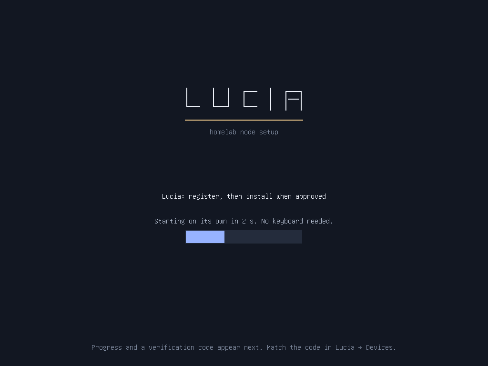
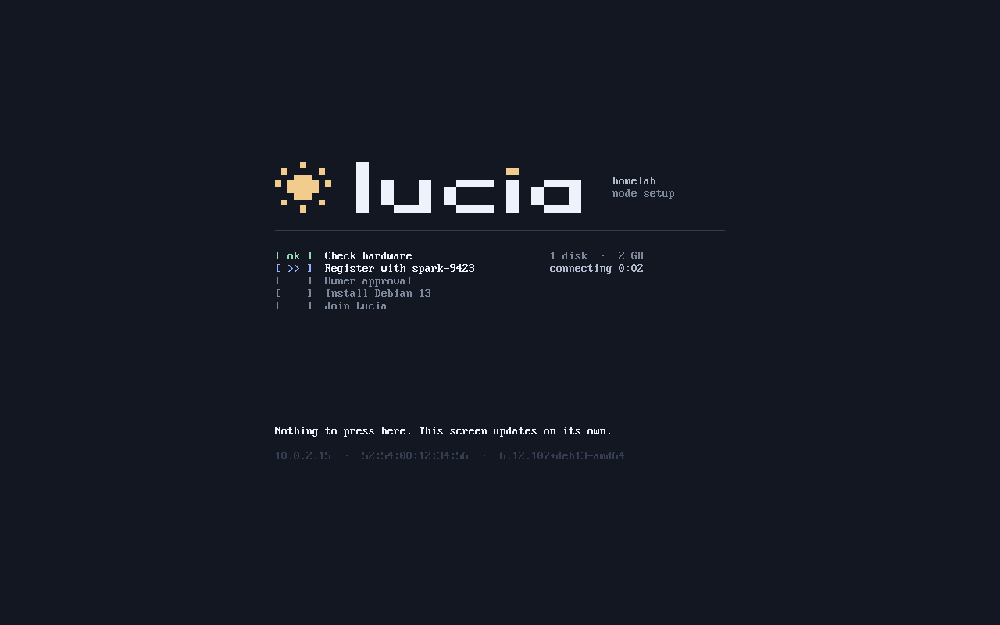
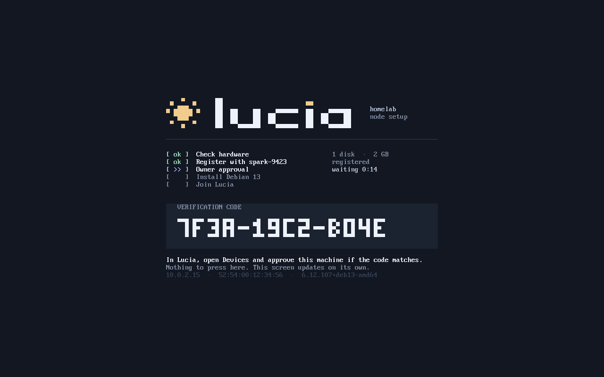
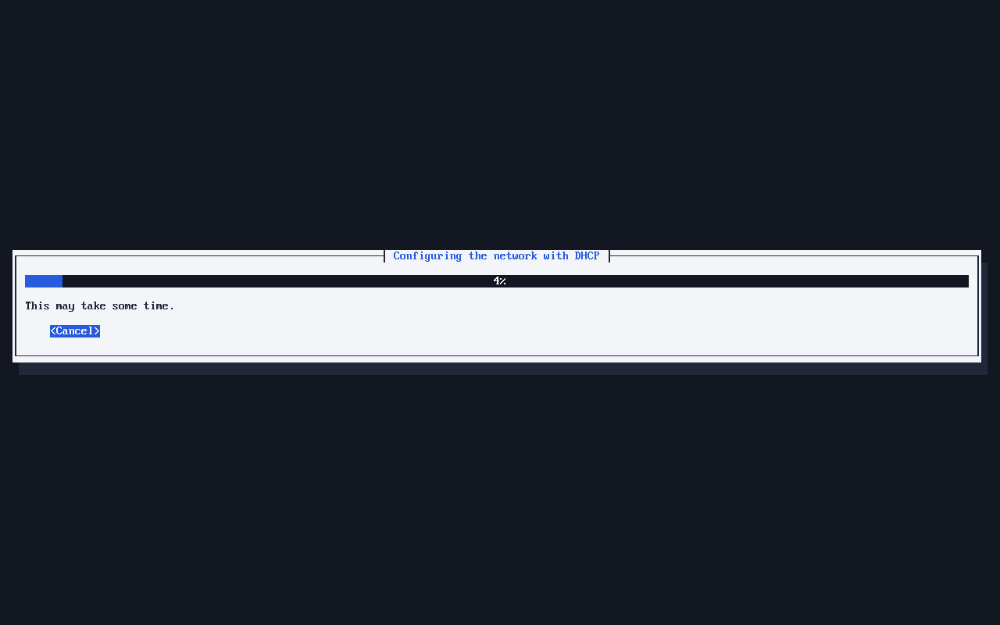
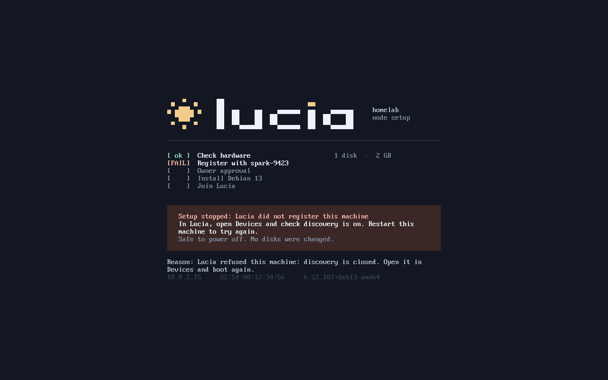

# Set up UniFi Network for Lucia

**UniFi Network is currently Lucia's only supported LAN-gateway platform.**
This guide covers a Dream Machine or another UniFi gateway managed through
UniFi Network.

Gateway boot configuration is a **manual, one-time prerequisite**; Lucia never
changes your DHCP boot options, networks or firewall. Never give Lucia your
UniFi password. The one optional connection is a UniFi API key, used only to
reserve managed servers' addresses (see
[Keep managed servers' addresses](#keep-managed-servers-addresses)).

The current onboarding milestone is **read-only discovery**. It reports
hardware and displays a comparison code. OS installation, disk erasure, and
managed-node LDAP/certificate enrollment remain disabled.

## Before you begin

- Give the Spark a stable IP address. Once UniFi is connected, Lucia reserves
  it for you (see
  [Keep managed servers' addresses](#keep-managed-servers-addresses)).
- Choose the network on which new servers will boot. The current qualified
  test arrangement puts the Spark and new hardware on the same LAN.
- Use x86-64 UEFI network boot. Legacy BIOS, ARM64, and routed/cross-VLAN PXE
  configurations are not yet qualified.
- Confirm that the controller's HTTPS hostname resolves through the DNS
  servers given to boot clients by DHCP.
- If the network already has a PXE server or custom DHCP boot options, review
  that configuration before replacing it.

Traditional PXE/TFTP does not authenticate the external boot configuration or
initrd. Use a trusted provisioning network; a dedicated provisioning VLAN is
preferred for a future qualified deployment. Do not expose boot services to
the internet or disable firewall/TLS protections to make onboarding work.

## One-time Dream Machine configuration

Open **UniFi Network → Settings → Networks**, then select the network on which
the new server will boot. Find its DHCP options and **Network Boot** setting.
Depending on the UniFi Network version, you may need to switch advanced
settings from **Auto** to **Manual**; section and field labels can vary.

Keep the UniFi gateway as the DHCP server. Enable **Network Boot** and enter:

| Setting | Value |
| --- | --- |
| Boot server / Server | The Spark's IPv4 address, with no URL scheme or port |
| Boot file / Filename | `debian-installer/amd64/bootnetx64.efi` |
| Separate **TFTP Server** toggle | Leave disabled for this setup |

Save/apply the network settings.

**Enable Network Boot, not both Network Boot and TFTP Server.** UniFi's
Network Boot option supplies DHCP options **66 and 67**. Its separate TFTP
Server option supplies **66** again; it is not a TFTP daemon and is not an
additional service Lucia needs. Do not add duplicate custom options 66/67.
Lucia serves the files from the Spark.

The boot filename is a TFTP path, not a web URL. Keep its forward slashes and
directory prefix exactly as shown; do not substitute `pxelinux.0`, a Windows
path, or a flattened `bootnetx64.efi` filename.

Lucia also serves the identical, verified Debian `grubx64.efi` at the TFTP root.
Some UEFI firmware downloads the configured shim bootloader correctly but then
requests GRUB from the root instead of the bootloader's directory. This
compatibility copy changes neither the boot filename above nor the read-only
GRUB configuration, kernel, or discovery overlay. Missing optional shim
revocation/certificate probes are not replaced with dummy files.

The discovery overlay includes Realtek Ethernet (`rtl_nic`) firmware from
Debian's `firmware-realtek` package, including `rtl8125b-2.fw` used by the
`r8169` driver. Package hashes are checked against the signed Debian release's
`non-free-firmware` index, and the package's redistribution terms are retained.
This firmware is loaded into RAM; Lucia does not flash the NIC or install an OS.
Other controllers may need additional firmware qualification.

### Current lab example

| Item | Current value |
| --- | --- |
| UniFi network | `192.168.0.0/23` |
| Spark / boot server | `192.168.0.222` |
| Controller URL | `https://spark-9423/` |
| Boot file | `debian-installer/amd64/bootnetx64.efi` |
| Client DNS service | AdGuard Home at `192.168.1.230` |
| Local DNS rewrite | `spark-9423` → `192.168.0.222` |

These addresses describe the current lab, not universal installation defaults.

## Local DNS and certificate trust

Create an A record or DNS rewrite for the controller's configured hostname,
pointing to the Spark's reserved address. Make this change in the DNS service
that boot clients actually use. If DHCP points to AdGuard Home or Pi-hole,
adding a record only on the Dream Machine is not enough.

For the lab example, add an AdGuard Home rewrite for `spark-9423` to
`192.168.0.222`. A hosts-file entry on your desktop does not configure DNS
for a newly booting server. Public DNS resolvers cannot resolve this private
hostname, so the boot network must use a resolver that knows the local record.

The discovery image includes the public Lucia CA, never its private key.
The hostname must match the server certificate, and the target's clock must
be accurate. Do not bypass certificate verification or change the URL to an
IP address that is absent from the certificate.

### Names for managed servers

Once your domain is active, Lucia adds an AdGuard rewrite for every managed
server: `<hostname>.<namespace>`, such as `lucialab01.homelab.seiggy.com`.
The address comes from the server's latest heartbeat, so it stays correct if
DHCP hands out a new lease. Lucia never changes a rewrite it did not create;
if one already exists for that name, **Domains** shows it as a conflict.

To use the short name (`ssh lucialab01`), set the network's **Domain Name**
in UniFi (Settings → Networks → your network) to the same namespace. DHCP
clients then add that suffix automatically.

### Keep managed servers' addresses

Connect UniFi in **Settings → UniFi Network** and each server Lucia onboards
keeps the address it got on first boot, so names, SSH and pinned services never
move. Create the key in UniFi Network under **Settings → Control Plane →
Integrations**, ideally as an admin limited to Network, then paste it with the
gateway's HTTPS address (for example `https://192.168.1.1`) and site (usually
`default`). UniFi gateways use a self-signed certificate: Lucia shows its
SHA-256 fingerprint, and once you have compared it with the one your browser
shows and trusted it, Lucia refuses any other certificate.

With **Reserve managed-node addresses automatically** on (the default), Lucia
sets a fixed IP on the UniFi client entries for the Spark's own boot address
and for each managed server's current lease, within seconds of onboarding, then
rechecks every five minutes. It only adds
reservations: a server you already reserved elsewhere, or an address another
device holds, is shown on the page and left alone. Turning the setting off or
disconnecting keeps every existing reservation. The key is encrypted on the
Spark and only sent to that gateway on your LAN.

### Signing in to managed servers

Sign in as your Lucia user: `ssh <username>@lucialab01`. Only members of
`lucia-owners` can sign in, and sudo asks for your Lucia password. To skip
the password, add your public keys once in **Settings → SSH keys**, either by
pasting them or importing them from GitHub. Every managed server picks up the
change at its next check-in, usually within a minute, and removing a key there
revokes it everywhere. `lucia-recovery` only ever accepts the recovery key
chosen when the server was approved.

## Each time you add hardware

1. Sign in to Lucia as an Owner and open **Devices → Add hardware**. This
   opens a 30-minute discovery window; **Extend** and **Stop discovery**
   control that window.
2. Connect the new server to the configured network. Enable UEFI network boot
   in its firmware and select that boot option.
3. Wait for the server to appear in Lucia. Match its displayed comparison code
   with the physical console, then inspect its reported hardware.

### What the server's screen shows

A monitor is optional. Every screen advances on its own and never waits for
a key.

*The boot menu starts on its own after 3 seconds.*

*Lucia checks the hardware, then registers the server.*

*Match this code in **Devices** before you approve the server.*

*After approval, the Debian installer runs unattended.*

*If setup stops, the screen says what to do and why. No disks were changed.*

**No disk installation takes place in the current discovery-only profile.**
Do not interpret discovery or an approval record as a completed installation.
Lucia reports Secure Boot state; it does not change firmware security settings.
The first development target uses Secure Boot off by its owner's choice, not
because TLS or LDAP requires it.

Leave the one-time UniFi Network Boot configuration in place. Lucia's
**Add hardware** window controls whether its TFTP service and new-discovery
admission are active; it does **not** toggle DHCP settings on the gateway.
Admission is closed by default, after host restart, and when the window expires.
There is no need to revisit UniFi for each server.

Network-first machines can wait for a PXE timeout while Lucia is closed.
After an OS is installed, prefer the local disk for normal boots and use a
one-time network-boot selection when deliberately onboarding or reprovisioning.

## Dismiss finished discoveries

On **Devices**, an Owner can choose **Dismiss discovery** for a rejected
discovery, such as an old qualification VM. It is hidden from the normal list
across refreshes, sign-ins, and host restarts. Use **View dismissed** and
**Restore to list** to see it again.

This is reversible hiding, not deletion of hardware or its record. Rejection
and revoked session authority remain intact, and both visibility changes are
recorded in the owner audit history. Restoring a record does not approve it.
Pending discoveries, installation tasks, and managed devices cannot be
dismissed this way. Dismissed records still count toward the bounded discovery
registry; this is not a purge or an automatic retention policy.

## Connectivity and troubleshooting

If firewall rules or network isolation apply, allow the selected provisioning
network to reach the required services, rather than opening access globally:

| Destination | Purpose |
| --- | --- |
| Spark UDP 69 and UDP 40000–40016 | TFTP and its bounded transfer-port range |
| Spark TCP 443 | Certificate-verified discovery preseed and API |
| Spark TCP 9080, when used by the configured boot profile | Public boot-asset HTTP delivery |
| Configured DNS resolver, UDP/TCP 53 | Controller-name lookup |

DHCP remains between the client and UniFi; do not start a second DHCP server
on the Spark. No WAN port forwarding is required.

| Symptom | Check |
| --- | --- |
| PXE times out or cannot download the boot file | Open a Lucia discovery window; verify the client's network, reserved Spark IP, exact boot filename, and UDP rules. |
| GRUB cannot find its configuration, kernel, or initrd | Preserve the `debian-installer/amd64/` layout and use Lucia's prepared bundle, not an arbitrary Debian installer menu. |
| The first bootloader downloads, then TFTP reports `/grubx64.efi` missing and returns to firmware | Update/reprepare Lucia's managed boot bundle so it includes the root GRUB compatibility copy. Keep the configured UniFi boot filename unchanged. |
| HTTPS preseed or registration fails | Check client DNS, target clock, hostname/certificate match, and the current public CA. Never disable TLS verification. |
| A disk has no stable identity | Leave it unapproved. Do not substitute `/dev/sda`, a disk index, or an inferred largest disk. |
| Installation controls are disabled | This is expected until the installer and node-enrollment work is qualified; opening discovery does not bypass that boundary. |
| Installer pauses at `check-missing-firmware`, before the device appears in Lucia | Read the missing filename on the diagnostic console (Alt+F4). Rebuild/update the discovery overlay with the matching verified Debian firmware, then restart network boot; an already booted installer will not pick up a replaced overlay. |

Reference: [UniFi DHCP Server — predefined DHCP options](https://help.ui.com/hc/en-us/articles/360012097513-UniFi-DHCP-Server).
